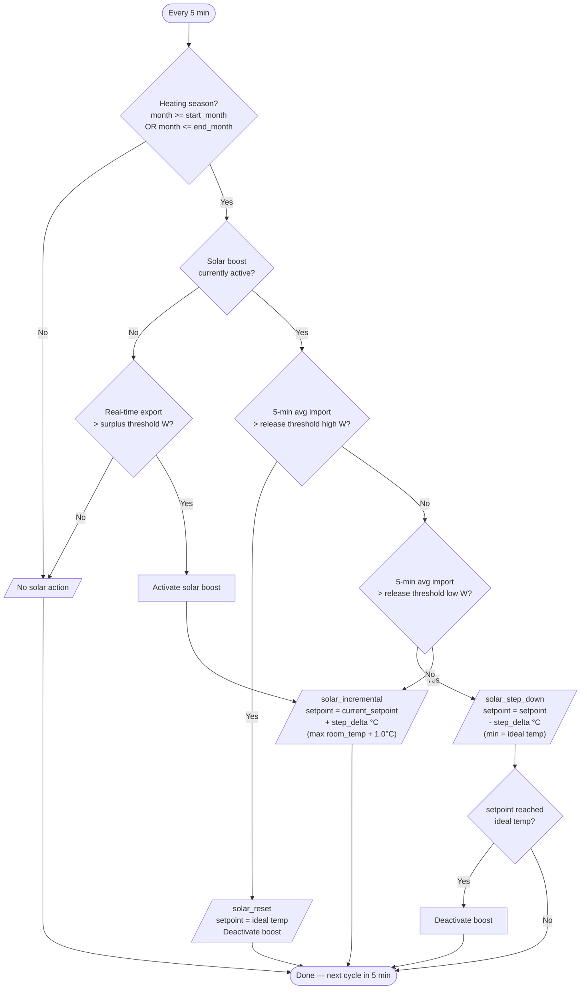

# Smart Heatpump Controller for Home Assistant

An intelligent thermostat controller that uses solar surplus to store free energy as heat in your floor. It adjusts your thermostat setpoint automatically — no direct heat pump API required. All logic runs locally with no cloud dependency.

---

## What it does

During the heating season, the controller watches your solar export in real time. When you're exporting more than you need, it incrementally raises the thermostat setpoint to store that free solar energy as heat in your floor mass. When the sun disappears and you start importing, it steps the setpoint back down — or resets immediately on high import.

Your temperature stays within a comfort band you define, without manual intervention.

---

## How it works

The controller runs every 5 minutes (configurable) and follows this decision flow:



### Key concepts

- **Heating season** — the flow only runs during configurable months (default September–April). Outside these months, no thermostat changes are made.
- **Incremental boost** — when solar boost first activates, the setpoint is set to `current_room_temperature + step_delta`. On each subsequent cycle with continued surplus, the setpoint steps up further from the *current setpoint* (not room temp). This means the setpoint climbs in steps: e.g. 21.5 → 22.0 → 22.5. The maximum boost is capped at **1.0°C above current room temperature** (two steps with the default 0.5°C delta), preventing overshooting.
- **5-minute rolling average** — import thresholds use a 5-minute rolling average to avoid reacting to brief spikes (e.g. a kettle or oven).
- **Two-tier release** — moderate import triggers a gradual step-down; high import triggers an immediate reset to ideal temperature.

### Real-world example

> **10:00** — Solar panels start exporting 600W. Export exceeds the 500W threshold → `solar_incremental` activates. Room is 21.0°C, so setpoint goes to 21.5°C.
>
> **10:05** — Still exporting surplus. Setpoint steps up from 21.5 → 22.0°C. Room is 21.1°C, cap is 21.1 + 1.0 = 22.1°C — still within cap.
>
> **10:10** — Still exporting. Setpoint would go to 22.5°C, but room is 21.2°C, cap is 22.2°C → clamped to **22.2°C**. Maximum boost reached.
>
> **10:30** — Room is 22.0°C. Cloud cover reduces production. 5-min average import rises to 400W (above 300W low threshold) → `solar_step_down`. Setpoint → 22.2 - 0.5 = 21.7°C.
>
> **10:35** — Heavy cloud. 5-min average import rises to 900W (above 800W high threshold) → `solar_reset`. Setpoint → 21.0°C (ideal). Boost deactivated.
>
> **10:40** — Sun returns, export is 700W → `solar_incremental` re-activates.

---

## Thermal learning system

The controller includes a thermal learning model that continuously learns your home's insulation characteristics. It observes indoor/outdoor temperatures during periods when heating is off (primarily nighttime cool-downs), calculates a heat loss coefficient, and can predict how many hours until your indoor temperature drops below the ideal.

This learning runs **independently** — it does not control the thermostat. The data is exposed via the **Thermal learning** sensor for your information and can be used in future automations.

### Solar gain filtering

The thermal model excludes observations where solar gain is likely (solar export detected, Forecast.Solar predicting production, or sun above 5° elevation). This ensures the model learns from clean nighttime cool-downs and produces a conservative heat loss estimate.

---

## Installation

### Step 1 — Add the repository in HACS

1. Open **HACS** in Home Assistant.
2. Click the **three dots** menu (top right) → **Custom repositories**.
3. Paste `https://github.com/antongitnow/ha-smart-heatpump` and select type **Integration**.
4. Click **Add**, then find **Smart Heatpump Controller** and click **Download**.
5. **Restart Home Assistant.**

### Step 2 — Add the integration

1. Go to **Settings → Devices & services**.
2. Click **+ Add integration** (bottom right).
3. Search for **Smart Heatpump Controller**.
4. Fill in the form:
   - **Power sensor** — your smart meter / P1 sensor (W). Must return negative values when exporting.
   - **Weather entity** — defaults to `weather.home` (Met.no).
5. Click **Submit**.
6. Go to **Configure** to add your thermostat, indoor temperature sensor, and notification targets.

### Dry run mode

Leave the thermostat field empty during setup. The controller runs normally — reads sensors, evaluates rules, logs decisions, and sends notifications — but does not touch any thermostat. The **Active rule** sensor shows a `mode: dry_run` attribute and the computed setpoint it *would* have set.

### Step 3 — Add the dashboard card (optional)

1. Open your dashboard → **Edit** (pencil icon) → **+ Add Card** → **Manual**.
2. Paste the contents of [`lovelace/dashboard_card.yaml`](lovelace/dashboard_card.yaml).
3. Click **Save**.

---

## Configuration

All parameters appear as slider entities under the **Smart Heatpump Controller** device.

| Parameter | Default | Range | Unit | Description |
|---|---|---|---|---|
| Ideal temperature | 21.0 | 16–26 | °C | Default comfort setpoint and safety floor |
| Minimum temperature | 20.5 | 14–24 | °C | Hard floor — setpoint never goes below this |
| Evaluation interval | 5 | 1–60 | min | How often the controller re-evaluates |
| Heating season start month | 9 | 1–12 | month | First month of heating season (e.g. 9 = September) |
| Heating season end month | 4 | 1–12 | month | Last month of heating season (e.g. 4 = April) |
| Solar surplus threshold | 500 | 0–5000 | W | Minimum real-time export to activate solar boost |
| Solar release threshold high | 800 | 0–5000 | W | 5-min avg import above which boost resets immediately |
| Solar release threshold low | 300 | 0–5000 | W | 5-min avg import above which boost steps down |
| Solar step delta | 0.5 | 0.1–3.0 | °C | How much to boost/step-down per cycle |

---

## Notifications

The controller sends a push notification every time it changes the thermostat setpoint.

1. Go to **Settings → Devices & services → Smart Heatpump Controller → Configure**.
2. In the **Notification targets** field, enter your notify service names (comma-separated, without the `notify.` prefix):
   ```
   mobile_app_my_phone, telegram
   ```
3. Click **Submit**.

Use the **Notifications** switch on the device or dashboard to mute/unmute without reconfiguring.

**Example notification:**

> **Smart Heatpump**
>
> ☀️ Solar surplus — boosting setpoint by step delta above current room temperature
>
> Rule: solar_incremental
> Room: 21.2°C
> Outdoor: 6.2°C
> Setpoint: 21.0°C → 21.7°C
>
> Current power: Export 680W
> 5-min avg: Import 0W
>
> Thresholds:
> &nbsp;&nbsp;Surplus activate: >500W export
> &nbsp;&nbsp;Release high: >800W import
> &nbsp;&nbsp;Release low: >300W import
> &nbsp;&nbsp;Step delta: 0.5°C

---

## Forecast.Solar (optional)

Forecast.Solar predicts solar production based on your panel configuration. When configured, the controller uses this data to improve the **thermal learning system** — it helps detect solar gain periods more accurately and excludes them from the heat loss model.

1. Install **Forecast.Solar** via HACS or the built-in integration.
2. Go to **Settings → Devices & services → Smart Heatpump Controller → Configure**.
3. Select your Forecast.Solar entity (typically `sensor.energy_production_next_hour`).
4. Click **Submit**.

---

## Active rules

The **Active rule** sensor shows the controller's current decision:

| Rule | Meaning |
|---|---|
| `solar_incremental` | Solar surplus detected — boosting setpoint incrementally |
| `solar_step_down` | Moderate import — stepping setpoint down by step delta |
| `solar_reset` | High import — resetting setpoint to ideal and deactivating boost |
| `solar_boost_deactivated` | Setpoint reached ideal after step-down — boost deactivated |
| `solar_boost_holding` | Solar boost active, holding current setpoint |
| `no_solar_action` | Outside heating season or no surplus — no action |
| `default` | Normal operation — maintaining ideal temperature |
| `error_fallback` | Error occurred — using safe fallback temperature |
| `initialising` | Controller starting up |

The sensor also exposes these attributes:
- `solar_boost_active` — whether the solar boost is currently active
- `computed_setpoint` — the setpoint the controller computed
- `current_power` — current import/export reading
- `avg_import_5min_w` — 5-minute rolling average import
- `indoor_temp` / `outdoor_temp` — latest readings

---

## Troubleshooting

### Setpoint not changing

- Check the **Active rule** sensor — it should update every evaluation cycle.
- If it shows `error_fallback`, check the Home Assistant log for errors.
- Verify the thermostat entity works: **Settings → Developer tools → Services** → `climate.set_temperature`.

### Solar boost not triggering

- Your power sensor must return **negative values** when exporting. Check in **Settings → Developer tools → States**.
- Real-time export must exceed the **Solar surplus threshold**.
- Verify you are within the configured **heating season** months.

### Solar boost stops too quickly

- Lower the **Solar release threshold low** to tolerate more import before stepping down.
- Lower the **Solar release threshold high** to tolerate more import before resetting.
- The 5-minute rolling average smooths out brief spikes. If you see false resets from short-lived import (e.g. kettle), the average should handle it.

---

## Contributing

Pull requests and issues are welcome. Please open an issue first to discuss significant changes.

When contributing code:
- Keep `decide_solar()` in `decision.py` as a pure function with no HA dependency.
- Add a test case in `tests/test_decision_logic.py` for any new decision logic.
- Run `pytest tests/` before submitting.

---

## License

MIT — see [LICENSE](LICENSE).
