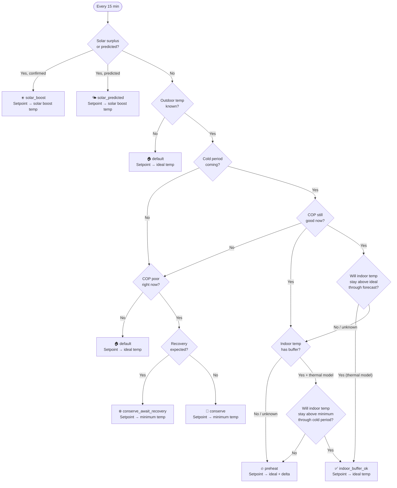

# Smart Heatpump Controller for Home Assistant

An intelligent thermostat controller that optimises heat pump operation based on real-time COP (Coefficient of Performance), solar surplus, and weather forecast. It adjusts your thermostat setpoint automatically — no direct heat pump API required. All logic runs locally with no cloud dependency.

---

## What it does

The controller watches your outdoor temperature, solar production, and weather forecast, then adjusts your thermostat setpoint to minimise grid energy use for heating:

- **Solar boost** — when your solar panels export excess electricity, it raises the setpoint to store that free energy as heat in your floor.
- **COP-aware pre-heating** — it checks the forecast and pre-heats your home while the heat pump is still efficient, before a cold period arrives.
- **Conservation mode** — when COP is poor (cold outside), it reduces heating to the minimum and waits for the next efficient window.
- **Floor heating lag** — it accounts for the 2–4 hour delay of floor heating systems by looking further ahead in the forecast.

Your temperature stays within a comfort band you define, without manual intervention.

---

## How it works

The controller combines three inputs — **solar production**, **weather forecast**, and **indoor temperature** — to pick the most energy-efficient setpoint every evaluation cycle (default: 15 minutes).

### Decision tree

Rules are evaluated top-to-bottom. The first match wins.



### What is COP and why it matters

**COP** (Coefficient of Performance) measures how efficiently a heat pump converts electricity into heat. At 10°C outside, a typical heat pump produces ~4 kWh of heat per 1 kWh of electricity (COP = 4). At −5°C, that drops to ~2 (COP = 2). Below a certain outdoor temperature, running the heat pump costs nearly as much as a direct electric heater.

The **COP threshold** (default 5°C) is the point where your heat pump's efficiency drops enough that it's smarter to wait for warmer weather. The controller uses this to decide when to conserve versus pre-heat.

### How forecasting works

The controller uses your Home Assistant weather entity (default: Met.no via `weather.home`) to look ahead:

1. **Effective forecast horizon** = forecast horizon + floor heating thermal lag. With defaults (24h + 3h = 27h), the controller looks 27 hours ahead.
2. It checks if outdoor temperature will drop **below** the COP threshold within this window.
3. If yes, and it's currently warm enough for efficient operation, it **pre-heats** — storing energy in your floor while the heat pump is still efficient.
4. If outdoor temperature is already below the COP threshold, it checks the **COP recovery horizon** (default 6h) to see if warmer weather is coming.

When **Forecast.Solar** is configured, the controller also checks predicted solar production. If the predicted output exceeds the **solar surplus threshold** (default 500W), it raises the setpoint to absorb that free energy — even before actual export begins.

### Thermal learning system

Without thermal data, the controller pre-heats conservatively — any forecast cold period triggers pre-heating. For a well-insulated home, this is often unnecessary.

The thermal learning system fixes this by learning how fast your home cools down:

```mermaid
flowchart LR
    subgraph Phase 1 — Learning
        direction TB
        OBSERVE["Observe indoor temp<br/>every 15 min"]
        FILTER["Filter: exclude heating<br/>and solar gain periods"]
        COOLDOWN["Detect clean cool-down<br/>periods (night only)"]
        RATE["Calculate heat loss rate<br/>(°C/hour at given ΔT)"]
        STORE["Store observations<br/>over 3–7 days"]
        OBSERVE --> FILTER --> COOLDOWN --> RATE --> STORE
    end

    subgraph Phase 2 — Predicting
        direction TB
        CURRENT["Current indoor temp"]
        FORECAST2["Weather forecast"]
        MODEL["Thermal model:<br/>hours until minimum"]
        DECIDE["Skip or pre-heat?"]
        CURRENT --> MODEL
        FORECAST2 --> MODEL
        MODEL --> DECIDE
    end

    STORE --> MODEL
```

**Phase 1 — Learning (first 3–7 days):**
- The controller watches indoor temperature trends during periods when heating is off.
- It calculates the **heat loss coefficient** — how many °C per hour your home loses at a given indoor-outdoor temperature difference.
- A well-insulated home might lose 0.3°C/hour at ΔT = 15°C. A poorly insulated home might lose 1.0°C/hour.

**Phase 2 — Predicting:**
- Given the current indoor temperature and the weather forecast, the model predicts **how many hours until indoor temperature drops below the minimum**.
- If that's longer than the cold period, it skips pre-heating entirely.
- If the model predicts the home will get too cold, it pre-heats as normal.

**During learning:** the controller behaves conservatively (always pre-heats). Once enough data is collected, it becomes smarter and avoids unnecessary heating — especially in well-insulated homes.

### Solar gain filtering

Passive solar gain — sunlight warming your house through windows — can mislead the thermal model. On a sunny winter day, indoor temperature drops slowly even with heating off. The model would conclude "this home is very well insulated" and later skip pre-heating. But that warmth was shallow (heated air and furniture, not the floor mass) and disappears quickly after sunset.

To prevent this, the learning system **excludes observations where solar gain is likely**:

| Signal | How it's detected |
|---|---|
| Solar panels producing | P1 sensor shows export (surplus > 0W) |
| Forecast.Solar active | Predicted production > 50W this hour |
| Sun above horizon | `sun.sun` entity shows elevation > 5° |

In practice this means the model primarily learns from **nighttime cool-downs** — when there's no solar influence and the observed heat loss is purely from insulation and thermal mass. This produces a conservative (higher) heat loss coefficient, which is exactly what you want: the model won't overestimate your home's ability to hold heat.

### Indoor temperature awareness

The controller uses indoor temperature in three ways:

1. **Ideal temp check** — if the thermal model predicts indoor temperature will stay above the ideal temperature (e.g. 21°C) through the entire forecast window, pre-heating is skipped entirely. This handles cases where it stays warm enough outside that the house simply won't cool down.
2. **Buffer check** — if indoor temperature is more than 1°C above the minimum, the home has thermal buffer. Combined with the thermal model, this can skip pre-heating even when a cold period is coming.
3. **Setpoint floor** — the setpoint never goes below `temp_minimum`, regardless of which rule is active.

### Real-world scenarios

**Scenario 1 — Sunny winter day (8°C, solar panels producing)**
> Solar panels export 800W. After 10 minutes sustained export, `solar_boost` activates. Setpoint rises to 22.5°C, storing free solar energy as heat in the floor for the cold evening ahead. Grid cost: €0.

**Scenario 2 — Late afternoon, cold night forecast (7°C now, forecast −2°C overnight)**
> It's above the COP threshold now (COP ≈ 3.5), but tonight it won't be. The thermal model predicts your well-insulated home will stay above 21°C for the entire forecast window. `indoor_buffer_ok` — the house won't cool down enough to need pre-heating.

**Scenario 3 — Same forecast, but poorly insulated home**
> Same weather, but the thermal model predicts only 3 hours of buffer. Cold arrives in 4 hours. `preheat` activates — setpoint rises to 21.5°C while the heat pump is still efficient (COP ≈ 3.5 vs. COP ≈ 1.8 at −2°C).

**Scenario 4 — Cold snap (−3°C, no recovery in 6 hours)**
> COP is poor (~1.8). Forecast shows no improvement within 6 hours. `conserve` — setpoint drops to 20.5°C minimum. The controller waits rather than running the heat pump inefficiently.

**Scenario 5 — Cold but warming up (−1°C now, forecast 7°C in 4 hours)**
> COP is poor, but recovery is coming. `conserve_await_recovery` — hold minimum temperature for a few hours, then resume normal heating when COP improves. Saves running the heat pump during the least efficient window.

---

## Installation

### Step 1 — Add the repository in HACS

1. Open **HACS** in Home Assistant.
2. Click the **three dots** menu (top right) → **Custom repositories**.
3. Paste `https://github.com/antongitnow/ha-smart-heatpump` and select type **Integration**.
4. Click **Add**, then find **Smart Heatpump Controller** and click **Download**.
5. **Restart Home Assistant.**

### Step 2 — Add the integration

1. Go to **Settings → Devices & services**.
2. Click **+ Add integration** (bottom right).
3. Search for **Smart Heatpump Controller**.
4. Fill in the form:
   - **Thermostat** — the climate entity for your heat pump. *Leave empty for dry run mode* (see below).
   - **Indoor temperature sensor** — optional standalone sensor. If omitted, the thermostat's built-in temperature is used.
   - **Power sensor** — your smart meter / P1 sensor (W).
   - **Weather entity** — defaults to `weather.home` (Met.no).
5. Click **Submit**. Done.

That's it. The controller is running. All parameters have sensible defaults and can be adjusted from the dashboard.

### Dry run mode

Leave the thermostat field empty during setup. The controller runs normally — reads sensors, evaluates rules, logs decisions, and sends notifications — but does not touch any thermostat. The **Active rule** sensor shows a `mode: dry_run` attribute and the computed setpoint it *would* have set. Use this to verify behaviour before connecting your heat pump.

### Step 3 — Add the dashboard card (optional)

1. Open your dashboard → **Edit** (pencil icon) → **+ Add Card** → **Manual**.
2. Paste the contents of [`lovelace/dashboard_card.yaml`](lovelace/dashboard_card.yaml).
3. Click **Save**.

This gives you sliders for all parameters (ideal temperature, COP threshold, solar surplus threshold, etc.) and a status display showing the active rule.

---

## Configuration

All parameters appear as slider entities under the **Smart Heatpump Controller** device in **Settings → Devices & services**. They are also usable on any dashboard card.

| Parameter | Default | Range | Unit | Description |
|---|---|---|---|---|
| Ideal temperature | 21.0 | 16–26 | °C | Default comfort setpoint |
| Minimum temperature | 20.5 | 14–24 | °C | Hard floor — setpoint never goes below this |
| Solar boost temperature | 22.5 | 18–26 | °C | Setpoint during solar surplus |
| Pre-heat delta | 0.5 | 0–2 | °C | Extra °C above ideal when pre-heating |
| COP threshold temperature | 5.0 | -10–15 | °C | Outdoor temp below which COP is considered poor |
| COP recovery horizon | 6 | 1–24 | h | Hours ahead to look for COP recovery |
| Solar surplus threshold | 500 | 0–5000 | W | Minimum export to trigger solar boost |
| Solar confirmation delay | 10 | 0–60 | min | Export must be sustained this long before boost |
| Forecast horizon | 24 | 1–48 | h | How far ahead to check for cold periods |
| Floor heating thermal lag | 3 | 0–6 | h | Floor heating warm-up lag |
| Evaluation interval | 15 | 5–60 | min | How often the controller re-evaluates |

---

## Notifications

The controller can send a push notification every time it changes the thermostat setpoint.

1. Go to **Settings → Devices & services → Smart Heatpump Controller → Configure**.
2. In the **Notification targets** field, enter your notify service names (comma-separated, without the `notify.` prefix):
   ```
   mobile_app_my_phone, telegram
   ```
3. Click **Submit**.

Use the **Notifications** switch on the device or dashboard to mute/unmute without reconfiguring.

**Example notification:**

> **Smart Heatpump**
>
> Cold period coming — pre-heating while COP is still efficient
>
> Setpoint: 21.0°C → 21.5°C
> Outdoor: 6.2°C
> Solar export: 0W
> Rule: preheat

---

## Forecast.Solar (optional)

Forecast.Solar predicts solar production based on your panel configuration. When configured, the controller pre-heats *before* solar surplus starts.

1. Install **Forecast.Solar** via HACS or the built-in integration.
2. Go to **Settings → Devices & services → Smart Heatpump Controller → Configure**.
3. Select your Forecast.Solar entity (typically `sensor.energy_production_next_hour`).
4. Click **Submit**.

---

## Active rules

The **Active rule** sensor shows the controller's current decision:

| Rule | Meaning |
|---|---|
| `solar_boost` | Confirmed solar export — storing free energy as heat |
| `solar_predicted` | Predicted solar export — pre-heating before surplus starts |
| `preheat` | Cold period coming — pre-heating while COP is still efficient |
| `indoor_buffer_ok` | Cold coming, but home has enough thermal buffer — skipping pre-heat |
| `conserve` | COP poor, no recovery expected — holding minimum temperature |
| `conserve_await_recovery` | COP poor, but recovery coming — waiting for efficient window |
| `default` | Normal operation — maintaining ideal temperature |
| `error_fallback` | Error occurred — using safe fallback temperature |
| `initialising` | Controller starting up |

---

## Troubleshooting

### Setpoint not changing

- Check the **Active rule** sensor — it should update every evaluation cycle.
- If it shows `error_fallback`, check the Home Assistant log for errors.
- Verify the thermostat entity works: **Settings → Developer tools → Services** → `climate.set_temperature`.

### Solar boost not triggering

- Your power sensor must return **negative values** when exporting. Check in **Settings → Developer tools → States**.
- Export must exceed the **Solar surplus threshold** for the **Solar confirmation delay** continuously.

### Pre-heat not triggering

- Outdoor temperature must be **above** the COP threshold for pre-heat to activate.
- The forecast must show temperatures dropping **below** the COP threshold within the effective horizon.

---

## Roadmap

**Planned:**

- **Dynamic electricity tariff optimisation** — integrate with real-time electricity prices (ENTSO-E, Tibber) to shift heating to low-price windows.
- **Multi-zone support** — control multiple thermostats with per-zone configuration.
- **Occupancy / presence setback** — reduce setpoint when no one is home.
- **Energy savings estimate in notifications** — include estimated kWh/€ saved.

---

## Contributing

Pull requests and issues are welcome. Please open an issue first to discuss significant changes.

When contributing code:
- Keep `decide()` in `decision.py` as a pure function with no HA dependency.
- Add a test case in `tests/test_decision_logic.py` for any new decision logic.
- Run `pytest tests/` before submitting.

---

## License

MIT — see [LICENSE](LICENSE).
